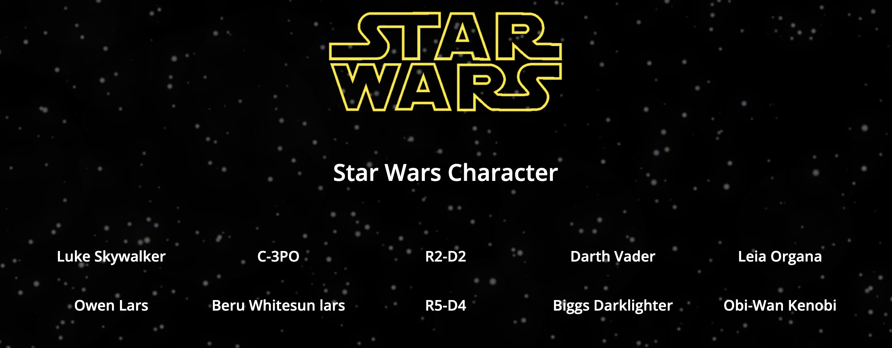

# Chu_Qiaoyi_Star Wars
This is a repo for Star Wars character data from the SWAPI and displays a list of characters. Clicking on a character shows the movies they appeared in, along with a brief description. The page includes GSAP animations and supports responsive design for a smooth user experience. ✨

## Installation
There is no installation required

## Usage
Open index.html in the browser of your choice.

## Contributing
1. Fork it!
2. Create your feature branch: `git checkout -b my-new-feature`
3. Commit your changes: `git commit -am 'Add some feature'`
4. Push to the branch: `git push origin my-new-feature`
5. Submit a pull request :D

## History
TODO: Write history

## Credits
Qiao-Yi, Chu

## License
MIT - please see license file.